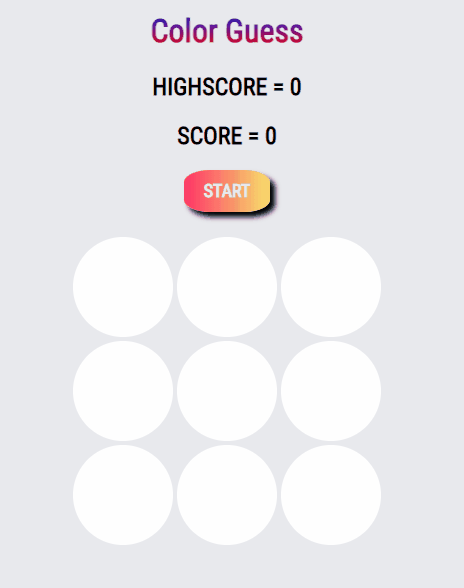

<h1 align="center">Color Guessing Game</h1>

<a href="#about">About</a> •
<a href="#technologies">Technologies</a> •
<a href="#demo">Demo</a>

<section id="about">
<h2>About</h2>

I had the idea to make this game after carrying out an activity proposed in the course <b>"The Web Developer Bootcamp 2022 - by Colt Steele"</b>, which consisted of creating a Score Keeper for table tennis matches.

While doing the activity, I had a new idea of ​​something I would like to try programming, when I remembered a filter I saw on Instagram.

This is how this project came about.

</section>
<section id="technologies">
<h2>Technologies</h2>

The technologies used to execute the project are the ones I have had contact with in the course so far, which are: <b>HTML, CSS</b> and <b>JavaScript</b>

I even considered using Bootstrap as a framework, but I decided to do all the CSS customizations myself.

This is how this project came about.

</section>
<h2>Demo</h2>

I started by doing the basic programming of the code: I added the elements in the HTML, programmed the game start function and the game end function.

Then I added the HTML element and coding for the scoring, followed by customizing the style, in the CSS file.

Finally, I added criteria to decrease the range of different colors as the score increased.

